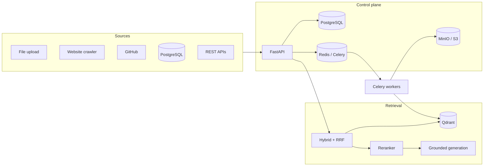

# CorpusForge

CorpusForge is a production-oriented multi-source RAG platform for ingesting, synchronizing, indexing, retrieving, and evaluating organizational knowledge across heterogeneous data sources.

This is not a "upload a PDF and chat" demo. It is an **Enterprise Knowledge & Operations Assistant**: a control plane and processing pipeline that an organization could adopt to connect Google Drive, GitHub, websites, PostgreSQL, REST APIs, and internal documents — then answer questions with **verifiable citations** and **permission-aware retrieval**.

## What this repository demonstrates

| Capability | Why it matters |
| --- | --- |
| Multi-source ingestion | Knowledge lives in many systems, not one upload box |
| Incremental sync | Only changed data is reprocessed |
| Document versioning | Old policies do not pollute current retrieval |
| Raw replayable storage | Re-run parsing without re-fetching sources |
| Deduplication | Exact and near-duplicate detection, never silent deletes |
| Async processing | Celery workers, bounded queues, backpressure |
| Hybrid retrieval | Dense + BM25 + rank fusion + reranking |
| Permission-aware search | ACLs enforced at retrieval, not by the LLM |
| Citations | Answers resolve to title, source, URL, page, section |
| Evaluation | Recall@K, MRR, nDCG, groundedness, experiment comparison |
| Observability | Structured logs, request correlation, ingestion/retrieval metrics |

## Architecture

```text
COLLECT → INGEST → STORE RAW → PARSE → NORMALIZE → DEDUPLICATE → ENRICH
    → CHUNK → EMBED → INDEX → RETRIEVE → RERANK → GENERATE → CITE → EVALUATE
```

Every layer is a first-class package under `backend/app/`. Core logic is implemented explicitly — not hidden behind `create_retriever()`.



See [docs/architecture.md](docs/architecture.md) for package layout, tenancy, and the phased build.

## Phase status

| Phase | Scope | Status |
| --- | --- | --- |
| 1 | Foundation: FastAPI, PostgreSQL, Redis, Celery, MinIO, Qdrant, Docker Compose, Alembic, health checks | **Complete** |
| 2 | Ingestion control plane: sources, canonical documents, hashing, versioning, state machine | **Complete** |
| 3–13 | Parsing through production hardening (frontend, evaluation, RBAC) | Planned |

## Local development

```bash
docker compose up --build
```

Postgres and Redis are published on **5433** and **6380** so they do not collide with other local databases. Inside the Compose network they still use 5432 and 6379.

Wait until `api` is healthy, then:

```bash
curl -s http://localhost:8000/health
curl -s http://localhost:8000/api/v1/health
curl -s http://localhost:8000/api/v1/health/ready
```

| Service | URL |
| --- | --- |
| API | http://localhost:8000 |
| OpenAPI | http://localhost:8000/docs |
| MinIO console | http://localhost:9001 (`minioadmin` / `minioadmin`) |
| Qdrant | http://localhost:6333 |
| PostgreSQL | localhost:5433 (container port 5432) |
| Redis | localhost:6380 (container port 6379) |

Useful targets:

```bash
make up          # docker compose up --build -d
make logs        # follow api + worker
make health      # probe liveness and detailed health
make test-unit   # pytest tests/unit
make lint        # ruff
make typecheck   # mypy
make down
```

Backend tests without Docker:

```bash
cd backend
python -m venv .venv && source .venv/bin/activate
pip install -e ".[dev]"
pytest tests/unit -q
```

## Documentation

- [Architecture](docs/architecture.md)
- [Ingestion](docs/ingestion.md)
- [Retrieval](docs/retrieval.md)
- [Security](docs/security.md)
- [Evaluation](docs/evaluation.md)
- [Deployment](docs/deployment.md)

## Design principles

1. **PostgreSQL is the control plane.** Documents, jobs, versions, ACLs, and evaluation runs live there.
2. **Raw bytes are preserved** in S3-compatible storage before transformation.
3. **Workers own expensive work.** The API enqueues; Celery processes.
4. **Idempotent upserts**, content hashes, and checkpoints make ingestion safe to retry.
5. **Permissions are query filters**, never prompt instructions.
6. **Schema changes go through Alembic.** The app never calls `create_all` on startup.
