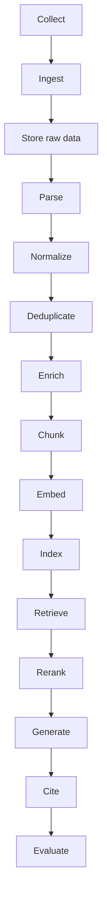
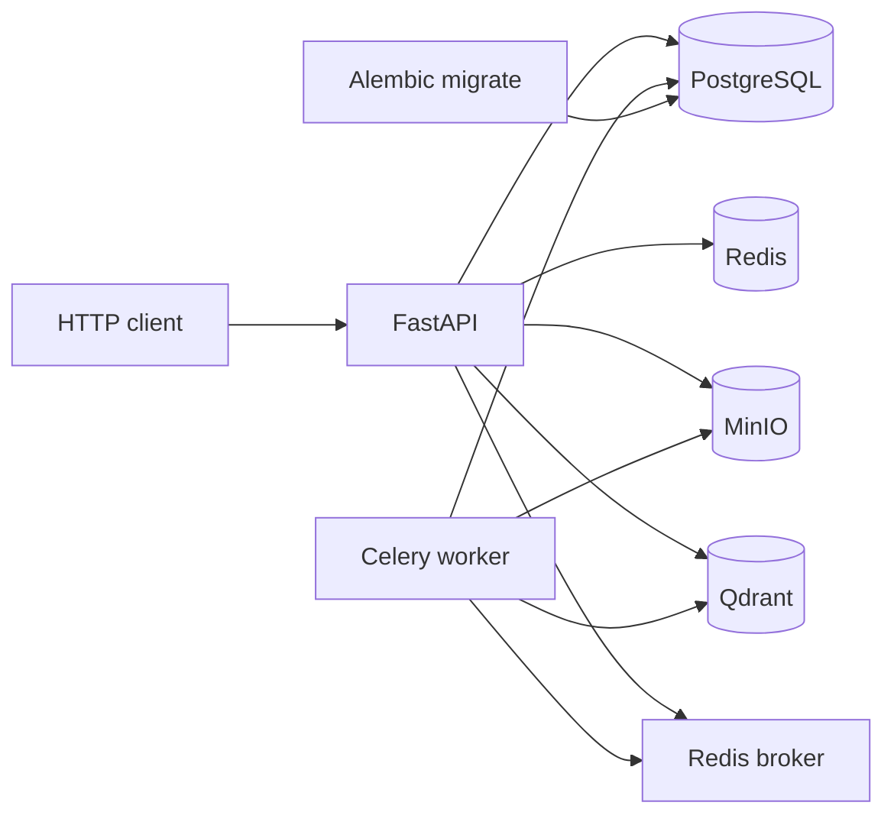

# Architecture

CorpusForge is a multi-tenant RAG **platform**, not a single-model chatbot. The control plane, object store, task queue, and vector index are separate systems with explicit contracts.

## Pipeline



Each box maps to a Python package under `backend/app/`. Later phases fill those packages; Phase 1 wires the processes they will run in.

## Runtime topology (Phase 1)



| Process | Role |
| --- | --- |
| `api` | HTTP control plane. Liveness at `/health`, readiness at `/api/v1/health/ready`. |
| `worker` | Celery consumer on `default`, `ingestion`, `embedding`, `indexing`. |
| `migrate` | One-shot `alembic upgrade head` before API/worker start. |
| `postgres` | Authoritative control-plane database. |
| `redis` | Cache, broker (DB 1), result backend (DB 2). |
| `minio` | S3-compatible raw object store. Bucket created by `minio-init`. |
| `qdrant` | Vector index. Collections are created in Phase 6, not at boot. |

## Why these boundaries

**PostgreSQL vs Qdrant.** Relational state (jobs, versions, ACLs, tenants) needs transactions and migrations. Vectors need ANN search. Mixing them in one store would couple operational recovery to retrieval internals.

**MinIO/S3 before parse.** Replaying a parser or embedding model must not require re-crawling GitHub or a website. Raw bytes plus content hashes make the pipeline deterministic.

**Celery vs in-request processing.** Parsing, OCR, embedding, and indexing are unbounded in time. The API should accept work and return job state. `worker_prefetch_multiplier=1` and `task_acks_late=True` are the backpressure starting point.

**Alembic, never `create_all`.** Implicit schema creation hides drift between environments. Migrations are the only way tables appear.

**Health vs readiness.** `/health` is process liveness (safe for load balancers). `/api/v1/health/ready` fails if PostgreSQL, Redis, MinIO, or Qdrant are down. Celery is optional on `/api/v1/health?celery=true` so the API can become ready while workers scale.

## Multi-tenant model (implemented from Phase 2)

```text
User → Organization → Workspace → Sources → Documents
```

Roles: `OWNER`, `ADMIN`, `EDITOR`, `MEMBER`, `VIEWER`. Retrieval always filters by organization and document ACL. The LLM is never the access-control layer.

## Package map

```text
backend/app/
  api/            HTTP transport (versioned /api/v1)
  auth/           JWT/session + RBAC (Phase 13)
  connectors/     Source collection protocol (Phase 2/10)
  ingestion/      Jobs, state machine, identity, hashing (Phase 2)
  parsers/        Structured blocks (Phase 3)
  normalization/  Cleaning + dedup (Phase 4)
  chunking/       Chunk strategies (Phase 5)
  embeddings/     Providers, batching, re-embed (Phase 6)
  indexing/       Qdrant writes + deletion (Phase 6/7)
  retrieval/      Dense/sparse/hybrid + ACL (Phase 7)
  reranking/      Cross-encoder / API (Phase 8)
  generation/     Grounded answers + citations (Phase 9)
  evaluation/     Metrics and experiments (Phase 11)
  workers/        Celery app and tasks
  observability/  Logging and metric names
  models/         SQLAlchemy control-plane models
  core/           Config, DB, Redis, S3, Qdrant, health
```

## Configuration

All process config is `pydantic-settings` (`app.core.config.Settings`). Docker Compose injects service hostnames. Local defaults match published ports so unit tests and a host-side venv can target the same stack.

## Known limitations (through Phase 3)

- Normalization, chunking, embeddings, and search are not implemented yet.
- JWT/RBAC is deferred to Phase 13; local APIs default to the Acme tenant.
- No Qdrant collections (Phase 6).
- Frontend is deferred to Phase 12.
- Scanned-PDF OCR needs Tesseract in the image; unit tests cover digital PDFs and the OCR gate, not a live Tesseract pass.
